<div align="center">
  
</div>

<div align="center">
  <table>
    <tr>
      <td align="left" valign="middle">
        <h2>Hey, I'm Shuvo Kumar Joy</h2>
        <h3>Full-Stack Developer</h3>
      </td>
      <td align="right" valign="middle">
        
      </td>
    </tr>
  </table>
</div>

<div align="center">

[](https://linkedin.com/in/shuvocse21)
[](https://commoner02.github.io/)
[](https://facebook.com/shuvo.587366)

</div>

## 👨‍💻 About Me

```yaml
name: Shuvo Kumar Joy
located_in: Khulna, Bangladesh
education: BSc in Computer Science & Engineering @ KUET
interests: [Web Development, Open Source, Computer Hardware, System Design]
current_focus: MERN Stack & Software Engineering
```

## 🛠️ Tech Stack

### **Languages**


### **Frontend**


### **Backend**


### **Database**


### **Tools & Platforms**


### **Core CS**
`OOP` `System Design` `Software Engineering` `REST APIs`

<h2 align="left">🔥 My Stats</h2>


<p align="center">
  
  
</p>

<div align="center">
  <!--START_SECTION:waka-->

```txt
From: 13 January 2026 - To: 12 February 2026

Total Time: 23 hrs 26 mins

JavaScript         12 hrs 59 mins  ██████████████░░░░░░░░░░░   55.41 %
Markdown           6 hrs 37 mins   ███████░░░░░░░░░░░░░░░░░░   28.25 %
Bash               1 hr 18 mins    █▒░░░░░░░░░░░░░░░░░░░░░░░   05.61 %
HTML               11 mins         ▒░░░░░░░░░░░░░░░░░░░░░░░░   00.79 %
```

<!--END_SECTION:waka-->
</div>


